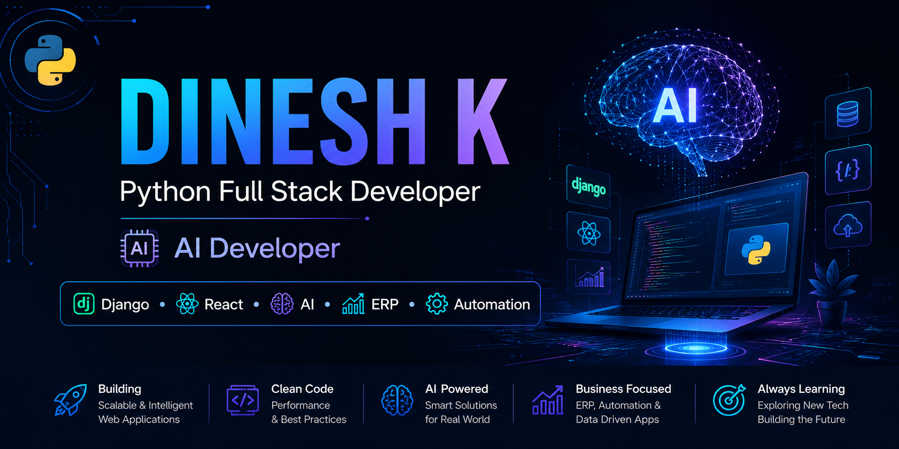

  

# 👋 Hi, I'm Dinesh K

### Python Full Stack Developer | AI Developer

I build scalable web applications, AI-powered tools, automation software, and enterprise ERP systems using Python and modern web technologies.

---

# 🚀 About Me

- 🔭 Currently building GPMS ERP System
- 🤖 Developing AI-powered Web Applications
- 🌱 Learning AI Engineering & System Design
- 💡 Passionate about solving real-world business problems
- 🎯 Goal: Become a World-Class AI Software Engineer

---

# 💻 Tech Stack

## Languages

- Python
- JavaScript
- HTML5
- CSS3
- SQL

## Frameworks

- Django
- Django REST Framework
- React (Learning)
- Bootstrap
- Tailwind CSS

## Database

- PostgreSQL
- SQLite
- MySQL

## Tools

- Git
- GitHub
- VS Code
- Postman
- Linux
- Figma

---

# 🤖 AI Stack

- OpenAI API
- Google Gemini
- Prompt Engineering
- AI Automation
- GitHub Copilot
- Cursor AI
- ChatGPT
- MCP (Learning)

---

# 🏭 Featured Projects

## GPMS ERP
Enterprise Resource Planning System for Manufacturing Industries.

## AI Salon Website
AI-powered salon booking and customer management platform.

## Personal Portfolio
Modern portfolio built using Python and Django.

## Python Automation
Automation scripts for daily business tasks.

---

# 📚 Currently Learning

- FastAPI
- Docker
- Cloud Deployment
- AI Agents
- LangChain
- System Design

---

# 🎯 2026 Goals

- Build Production Ready ERP
- Master AI Engineering
- Contribute to Open Source
- Become a Freelance AI Developer

---

# 📫 Connect

📧 Email:
d860848@gmail.com

🌐 Portfolio:
Coming Soon

💼 LinkedIn:
Coming Soon
